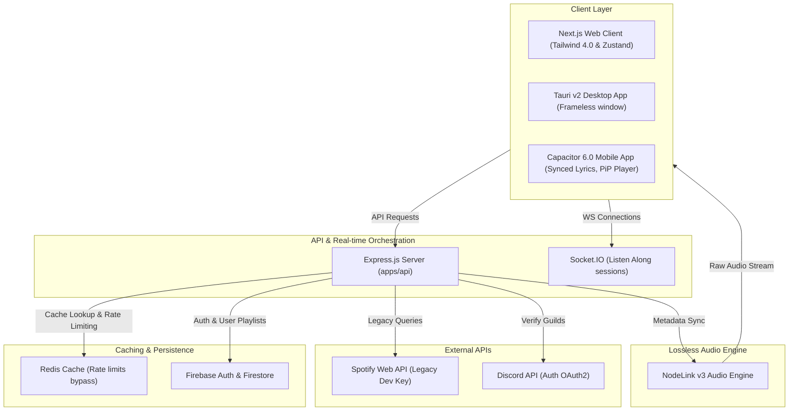

So, you want to build a music streaming platform. You think it is easy: just fetch some audio, play it in the browser, and boom, you are the next Spotify. But then reality hits you like a cold cup of water at 3 AM. You get hit with buffering lag, audio quality degradation, and the final boss: IP blocking and rate limiting from cloud datacenters.

That is why I built [Melofy](https://melofy.jene.in/), a zero-latency, high-performance music streaming platform. It is a premium music ecosystem fr fr. You can import your Spotify playlists, sync up with your friends using Listen Along, and enjoy high-fidelity audio. The source code is public, so check out the [Melofy GitHub repository](https://github.com/ShreyJaiswal1/melofy) if you want to see how the codebase is structured.

Here is the visual proof of the app dashboard in action:

## The Core System Architecture

To help you visualize how this whole operation works (and how many pieces of duct tape are holding it together), here is a flowchart of the Melofy system:

---

## Project Metadata Details

Here is the technical specification breakdown for the Melofy repository and deployment environment:

*   **Development Started**: March 9, 2026.
*   **Repository Pattern**: Monorepo managed via Turborepo (splitting packages into apps/web, apps/api, and shared configurations).
*   **Primary Code Language**: TypeScript (98.5% across the monorepo).
*   **Database Stack**: Firebase Firestore for playlist mapping, user settings, and metadata persistence.
*   **Authentication**: Firebase Auth supporting Discord OAuth2 logins.
*   **Real-time Protocol**: WebSockets handled by Socket.IO.

---

## The Closet Server: Escaping Datacenter Blocking

First, let's talk hosting. If you deploy an audio scraper or streaming API on AWS, GCP, or DigitalOcean, big streaming platforms will detect the datacenter IP range and ban it faster than you can say no cap.

To escape this datacenter blocking, Melofy's backend runs on my legendary home server: a computer powered by an Intel Core i7 3rd Gen processor. Yes, you read that right. A CPU from 2012. It has 4 cores, 8 threads, 12GB of RAM (we upgraded it from 8GB, living large now), a thick layer of dust, and a dream.

Hosting it at home means we route traffic through a residential IP. The big platforms think it is just a normal human listening to music, which is technically true. Plus, the i7 3rd Gen doubles as a room heater during winters. That is what I call efficiency.

---

## Bypassing Spotify Rate Limits with Redis

If you have ever built an app that interfaces with the [Spotify Web API](https://developer.spotify.com/documentation/web-api), you know their rate limiting is absolutely brutal. Look at their endpoint sideways and you get a 429 error.

To keep the app running smoothly on my 12GB RAM closet server, I set up a local [Redis](https://redis.io/) cache. Whenever a user searches for a track or imports a playlist:
1. We check if the data exists in Redis.
2. If it is cached, we serve it instantly (zero API calls, zero latency).
3. If it is not, we fetch it from Spotify and cache it for 24 hours.

This cache-first strategy keeps our API quota clean and saves our home server from getting blacklisted.

---

## The Holy Grail: The Legacy API Key

Now for some secret sauce. In late 2024 and early 2025, Spotify dropped a massive announcement that sent shockwaves through the developer community: they officially deprecated and blocked several core endpoints for all new applications. Specifically, endpoints like:
- `GET /v1/recommendations` (for generating personalized tracks)
- `GET /v1/audio-features` (for getting acoustic metrics like danceability or energy)
- `GET /v1/audio-analysis` (for deep audio breakdown)

If you register a new application today, you get a 403 Forbidden error if you try to call these. But thankfully, I have an old developer account created before the deprecations. Because of this, my legacy API key still has access to these blocked endpoints!

We are using this legacy access to build hyper-personalized mixes and recommendation features that new Spotify wrapper apps can only dream of. It is basically a developer cheat code.

---

## Going Mobile: Synced Lyrics and PiP Player

While the web and desktop versions look incredible, the mobile app (compiled via [Capacitor 6.0](https://capacitorjs.com/)) takes things to the next level. We built specific mobile features to match premium native music players:

### Synced Lyrics
Nobody wants static text. Melofy fetches LRC format lyric files and parses them in real-time. The lyrics scroll automatically and highlight the exact line being sung, synced perfectly to the audio track.

### Picture-in-Picture (PiP) Player
Want to browse social media while listening? We implemented a native Picture-in-Picture floating mini-player. You can play, pause, or skip tracks from a floating widget overlay on your phone screen without returning to the app.

---

## The Tech Stack: Monorepo Coding

We are using a [Turborepo](https://turbo.build/) monorepo to manage this beast. The project is split into clean folders:

- **apps/web**: The Next.js 16 frontend. It has a beautiful glassmorphic client interface.
- **apps/api**: The Express.js backend that runs on my 12GB RAM home server.
- **Desktop Client**: [Tauri v2](https://tauri.app/) compiles the web app into a lightweight native desktop app.
- **Mobile Client**: [Capacitor 6.0](https://capacitorjs.com/) wraps it for Android and iOS.

---

## Lossless Streaming via NodeLink

Most browser-based audio players sound compressed because they use cheap, default decoders. Melofy uses [NodeLink v3](https://nodelink.js.org/), which is a high-performance audio engine.

NodeLink pulls high-quality audio chunks and streams them directly to the client's audio context:

- **Lossless Audio**: No quality loss, no extra compression, just pure music vibes.
- **Zero Latency**: Aggressive pre-buffering makes sure the music starts instantly.
- **Auto Fallbacks**: If the home network starts crying, it automatically adjusts the stream.

Here is what the dark mode dashboard looks like in action:

---

## Real-Time Vibing: Listen Along

Listening to music alone is cool, but listening with friends is top-tier main character energy. The Listen Along feature keeps playback fully synchronized between friends down to the millisecond.

If the host plays, pauses, or seeks, everyone's player changes instantly. We built this using Socket.IO and some basic math:

- **Socket Rooms**: The backend puts friends into the same virtual listening room.
- **Drift Correction**: The client calculates network round-trip time (RTT) to correct audio drift. If your friend's player is 100ms behind, it jumps forward automatically.
- **Zustand State**: Zustand handles the player state on the client side, keeping everything in sync without reloading the page.

---

## Porting Your Spotify Playlists

No one wants to manually recreate 500-song playlists. The Spotify Importer connects via Spotify OAuth 2.0, fetches your tracks, and matches them to our high-fidelity database.

The import flow works like this:

1. **Auth Check**: You log in with your Spotify account.
2. **Metadata Fetch**: We get your playlist details.
3. **Fuzzy Match**: We search our database for the highest quality audio match.
4. **Import Complete**: We save the playlist to Firebase Firestore, ready to stream.

Here is the clean light mode theme for daytime listening:

---

## Downloads & Community Socials

Ready to start streaming or want to host it yourself? Get connected:

*   **Web App Client**: Stream directly at the [Melofy Production Web App](https://melofy.jene.in/).
*   **Desktop & Mobile Builds**: Grab installer packages from the [Melofy GitHub Releases Page](https://github.com/ShreyJaiswal1/melofy/releases).
*   **Community Hangout**: Join the [LazyDevs Discord Server](https://discord.com/invite/ZVCB8EnRX2) where we code, develop a developer-friendly community, and hang out.
*   **Documentation & Audio Core**: Learn how the audio streaming server functions at the [NodeLink Website](https://nodelink.js.org/).

---

## Confession: AI Co-Piloting

Let's be real for a second: if you look closely at the code, it is probably a little sloppy. There might be some wild hacks in there. And why? Because of course I let AI models do a lot of the heavy lifting. Massive shoutout and huge props to **Gemini 3.5 Flash**, **Opus 4.6**, and **GPT 5.5** for basically co-authoring this app with me. If something is broken, please blame them, not my 12GB RAM server.

Go check out [Melofy](https://melofy.jene.in/) or check the [Melofy GitHub](https://github.com/ShreyJaiswal1/melofy) to run it yourself!
